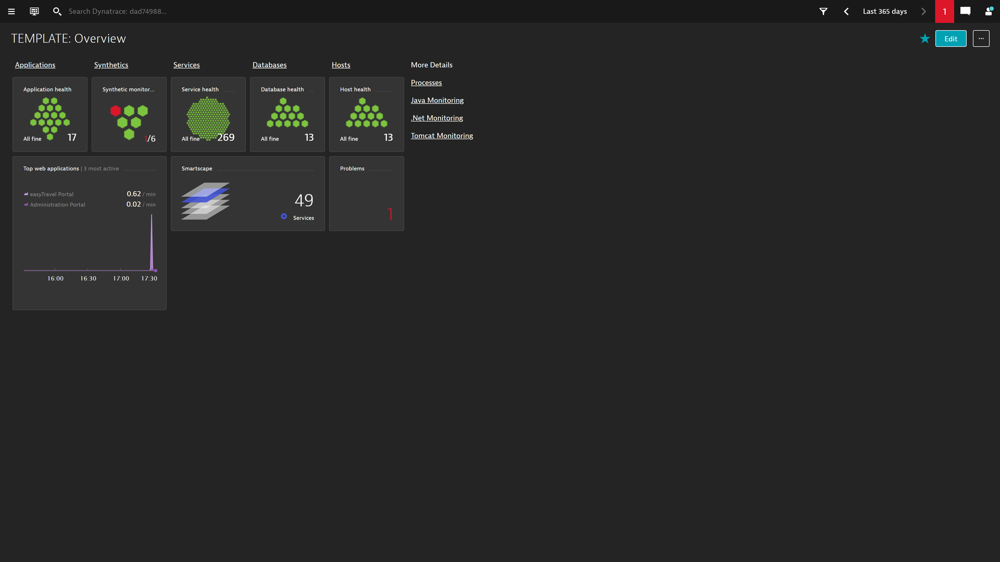
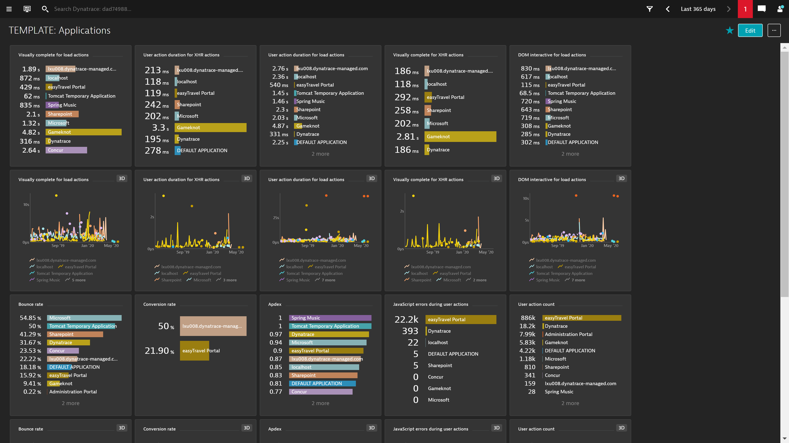
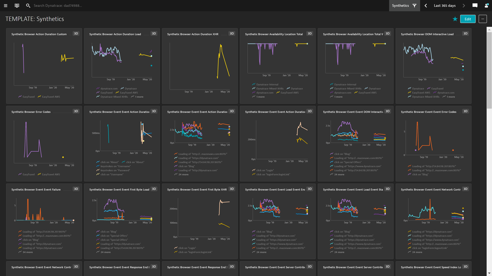
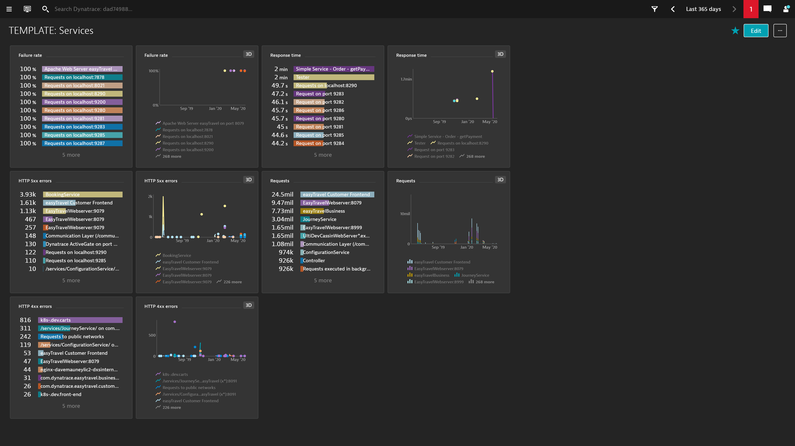
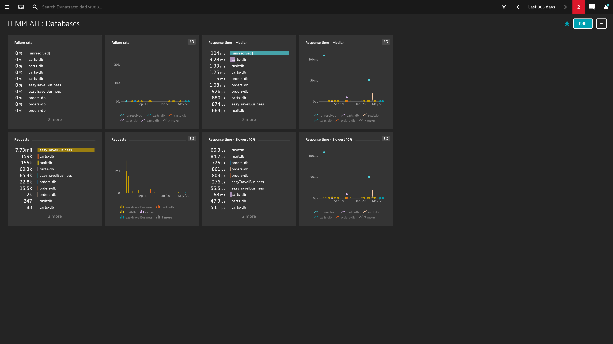
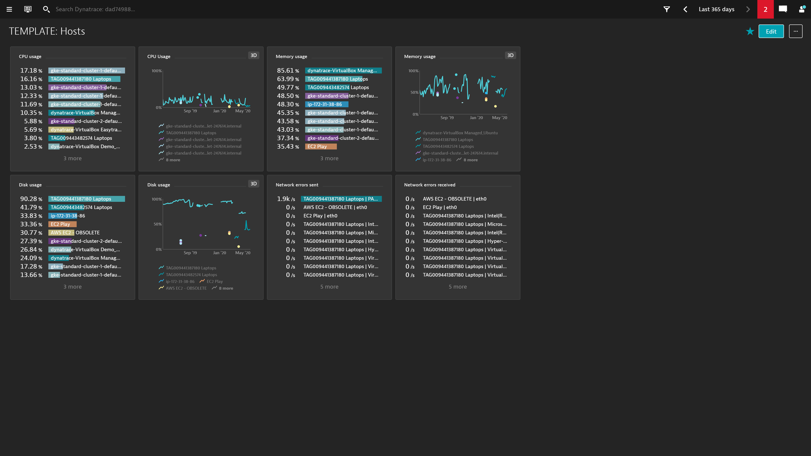
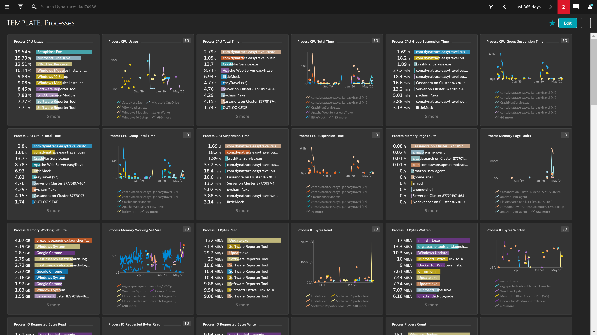
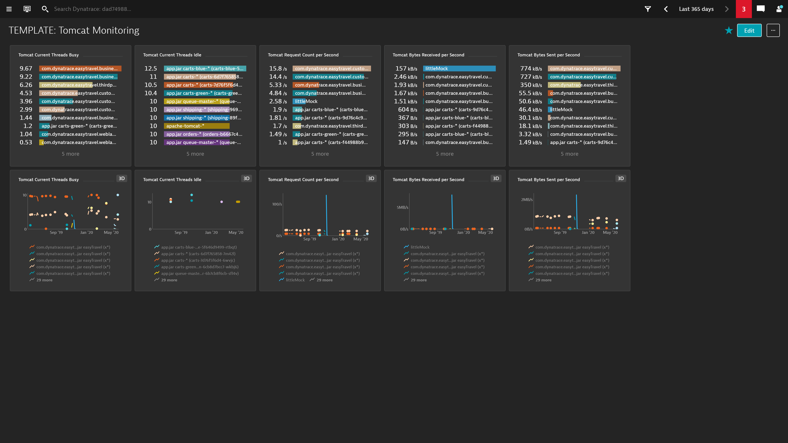

# DashboardTemplates
Dynatrace Dashboards that are generic enough to use as a starting point with any customer.   
They are not limited to specific entities and work well with Management Zones. 

If you would like to view these dashboards, I can give you readonly access to my personal tenant. 

Screenshots:

The following list will help you identify dashboards by ID: 
00000000-dddd-bbbb-ffff-000000000001 TEMPLATE: Overview 
00000000-dddd-bbbb-ffff-000000000002 TEMPLATE: Applications 
00000000-dddd-bbbb-ffff-000000000003 TEMPLATE: Synthetics 
00000000-dddd-bbbb-ffff-000000000004 TEMPLATE: Services 
00000000-dddd-bbbb-ffff-000000000005 TEMPLATE: Databases 
00000000-dddd-bbbb-ffff-000000000006 TEMPLATE: Hosts 
00000000-dddd-bbbb-ffff-000000000007 TEMPLATE: Processes 
00000000-dddd-bbbb-ffff-000000000008 TEMPLATE: Java Monitoring 
00000000-dddd-bbbb-ffff-000000000009 TEMPLATE: .NET Monitoring 
00000000-dddd-bbbb-ffff-000000000010 TEMPLATE: Tomcat Monitoring 

Notes:  
The Overview dashboard provides drilldowns to child dashboards via markdown tiles. 
You might want to modify the owner to your email address or a customer email address. 
Version differences can be an issue, so select the most recent version equal or prior to the version of the cluster/tenant you are importing into.  
Always use PUT rather than POST as the IDs are designed to remain static and PUT allows that.  
